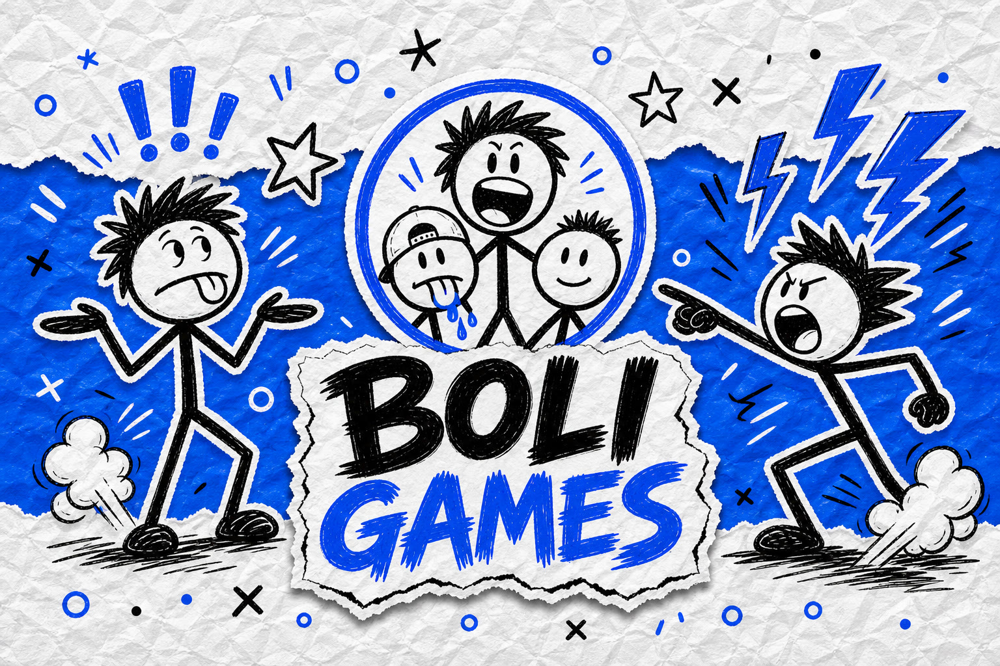

# Impractical Games — `.github`

Org profile and shared GitHub assets.

- **Profile README:** [`profile/README.md`](./profile/README.md) (shown on [github.com/Boli-Games](https://github.com/Boli-Games))
- **Assets:** [`assets/`](./assets/)
