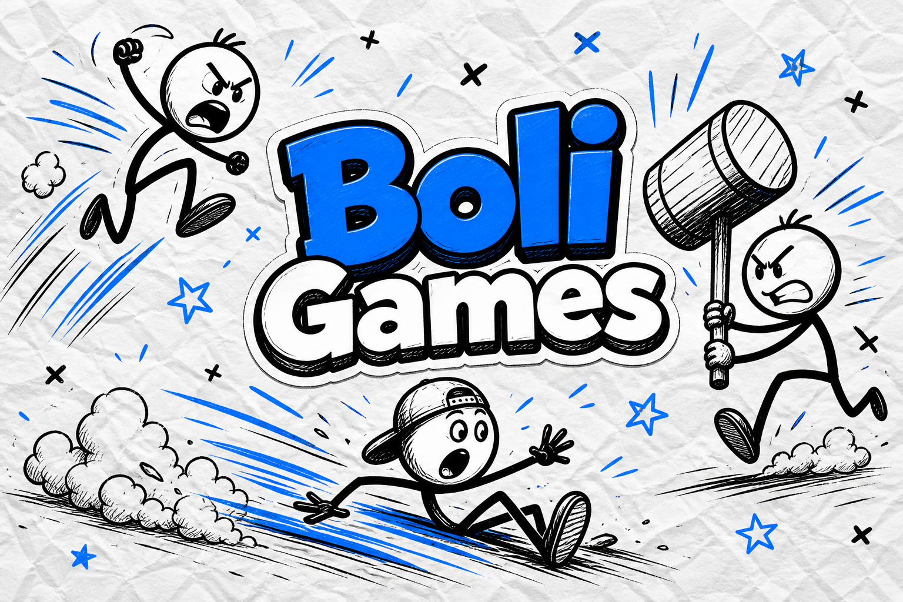

<div align="center">



<br /><br />

[![github][github-shield]][github-link]
[![play source][game-shield]][game-link]
[![rooms][rooms-shield]][rooms-link]
[![stack][stack-shield]][stack-link]

</div>

### 👋 Bienvenido a Impractical Games

Hacemos juegos que se sienten un poco imposibles — y por eso dan ganas de jugarlos.

**Boli** es escondite en primera persona: un cazador entre la manada; el resto de los jugadores se hacen los bolis. Podés jugar solo o armar una partida privada con amigos. Mezclate con la muchedumbre, sobreviví diez minutos o completá la misión secreta… sin que te descubran.

Los repositorios de abajo son el código abierto del juego: cliente Three.js + salas en Cloudflare Workers. Jugable hoy, forkeable mañana.

### ⭐️ Nuestros proyectos

| Proyecto | Descripción |
| :--- | :--- |
| [**🎮 Boli**][game-link] | Escondite FPS entre una manada de NPCs. Solo (Tab cambia de rol) o salas privadas con código de 4 letras / link `?room=`. Un cazador con escopeta; infiltrados que se mimetizan. Misión secreta (techo, mesa, loma), munición limitada y castigo por tumbar NPCs. [![][game-shield]][game-link] [![][rooms-shield]][rooms-link] |

### 📦 Ecosistema

| Repositorio / capa | Propósito | Lenguaje |
| :--- | :--- | :---: |
| [**🎮 Boli**][game-link] | Cliente Vite + simulación + vista Three.js + menú / lobby | ![][lang-typescript] |
| `src/sim/` | Lógica pura — mundo, física, AI de bolis, cazador, infiltrados, objetivos | ![][lang-typescript] |
| `src/view.ts` | Render Three.js en primera persona + HUD | ![][lang-typescript] |
| `src/net/` | Protocolo de sala y sincronización de inputs / snapshots | ![][lang-typescript] |
| `party/` | Durable Object `BoliRoom` — lobby, sorteo de roles, relay | ![][lang-typescript] |
| `wrangler.jsonc` | Deploy de salas a Cloudflare Workers (`boli-rooms`) | ![][lang-workers] |

### 🏗️ Cómo encaja

```
                 Menú Boli (solo / crear / unirse)
                              │
              ┌───────────────┼───────────────┐
              │               │               │
           Jugar solo    Crear sala      Unirse ?room=
              │               │               │
              ▼               └───────┬───────┘
     simulación local                 ▼
     (Tab = cambiar rol)     Cloudflare Worker
                             BoliRoom (Durable Object)
                                      │
                          sortea 1 cazador + infiltrados
                                      │
                                      ▼
                         cliente Three.js (todos)
                                      │
                    ┌─────────────────┼─────────────────┐
                    │                 │                 │
               inputs net        snapshot          HUD / misión
               (WASD, mirar,     del host          techo · mesa · loma
                disparar, Shift)
```

**Flujo online:** el anfitrión crea un código de 4 letras → amigos entran con el código o `?room=XXXX` → al empezar se sortea 1 cazador y el resto infiltrados → Tab **no** cambia el rol. En solo, Tab sí alterna entre infiltrado y cazador.

### 🎯 Qué hace distinto a Boli

| | Escondite clásico | Boli |
| :--- | :--- | :--- |
| Dónde te escondés | Detrás de un objeto | **Dentro** de la manada |
| El riesgo al disparar | Pegarle al infiltrado | Pegarle a un NPC te cuesta HP |
| Victoria infiltrada | Solo correr el reloj | Sobrevivir **o** completar la misión |
| Partidas con amigos | Servidor pesado | Código de 4 letras / link, hasta 8 |

**Tagline:** *"Escondite entre la manada. Un cazador. El resto, bolis."*

**La idea:** el mejor camuflaje no es invisibilidad — es portarte como uno más. Shift activa el **modo boli**; el cazador apuesta cada cartucho.

### ⚔️ Gameplay (build actual)

- **Roles:** 1 **cazador** (escopeta, primera persona) y **infiltrados** mezclados con ~28 bolis NPC.
- **Victoria infiltrados:** sobrevivir **10 minutos** o completar la misión secreta (**techo**, **mesa**, **loma**).
- **Victoria cazador:** tumbar a todos los infiltrados (3 impactos para derribar).
- **Munición:** 8 cartuchos al inicio (máx. 12); 3 cajas en el mapa (+2 c/u).
- **Riesgo:** −20 HP si le pegás a un NPC; −30 extra si lo tumbás. Si el cazador llega a 0 HP, ganan los infiltrados.
- **Modos:**
  - **Jugar solo** — un infiltrado + un cazador; **Tab** cambia de rol.
  - **Partida privada** — código de 4 letras; al empezar se sortean los roles.
  - **Unirse** — código o link `?room=K7MQ`.
- **Controles:** clic (capturar mouse / disparar) · WASD · Shift (modo boli) · Espacio (menú).
- **Online:** hasta 8 jugadores; salas en Cloudflare Workers.

### 🛠️ Stack

| | |
| :--- | :--- |
| **Cliente** | Vite + TypeScript + Three.js |
| **Simulación** | `src/sim/` — determinista / compartible entre modos |
| **Multijugador** | PartyServer + Durable Objects (`BoliRoom`) |
| **Salas (prod)** | [`boli-rooms.wealthy-piper.workers.dev`][rooms-link] |
| **Frontend deploy** | Vercel (`vercel.json` → build Vite) |

### 🚀 Desarrollo local

```bash
git clone https://github.com/ImpracticalGames/Boli.git
cd Boli
npm install
npm run party:dev   # Wrangler → salas en 127.0.0.1:8787
npm run dev         # Vite → cliente
```

En producción el cliente usa `VITE_PARTYKIT_HOST` (ver `.env.production`).

### 🤝 Contribuir

Bienvenidos PRs, reportes de bugs y feedback de gameplay.

- **Reglas / ritmo** — tunear `RHYTHM` y `ROUND` en `src/sim/types.ts`.
- **Mundo y misión** — objetivos, casas, cajas de munición en `src/sim/world.ts`.
- **AI de la manada** — `src/sim/boliAi.ts` (wander, regroup, behavior checks).
- **Salas** — lobby, capacidad y protocol en `party/server.ts` + `src/net/`.
- **Vista / HUD** — `src/view.ts` y estilos en `index.html`.

### 🪪 Licencia

Por repositorio. Ver cada repo para los detalles.

---

> [!TIP]
>
> **Probalo:** [abrí Boli][game-link] → **Jugar solo** para aprender el ritmo → **Crear partida** y mandale el código a un amigo. El que se mueva raro… no es boli.

[github-link]: https://github.com/ImpracticalGames
[github-shield]: https://img.shields.io/badge/org-Impractical%20Games-2F6BFF?labelColor=111111&style=flat-square&logo=github&logoColor=white

[game-link]: https://github.com/ImpracticalGames/Boli
[game-shield]: https://img.shields.io/badge/game-Boli-2F6BFF?labelColor=111111&style=flat-square&logo=github&logoColor=white

[rooms-link]: https://boli-rooms.wealthy-piper.workers.dev
[rooms-shield]: https://img.shields.io/badge/rooms-Cloudflare%20Workers-2F6BFF?labelColor=111111&style=flat-square&logo=cloudflare&logoColor=white

[stack-link]: https://github.com/ImpracticalGames/Boli#desarrollo
[stack-shield]: https://img.shields.io/badge/stack-Three.js%20%2B%20Vite-2F6BFF?labelColor=111111&style=flat-square&logo=threedotjs&logoColor=white

[lang-typescript]: https://img.shields.io/badge/typescript-2F6BFF?labelColor=111111&style=flat-square&logo=typescript&logoColor=white
[lang-workers]: https://img.shields.io/badge/workers-2F6BFF?labelColor=111111&style=flat-square&logo=cloudflare&logoColor=white
